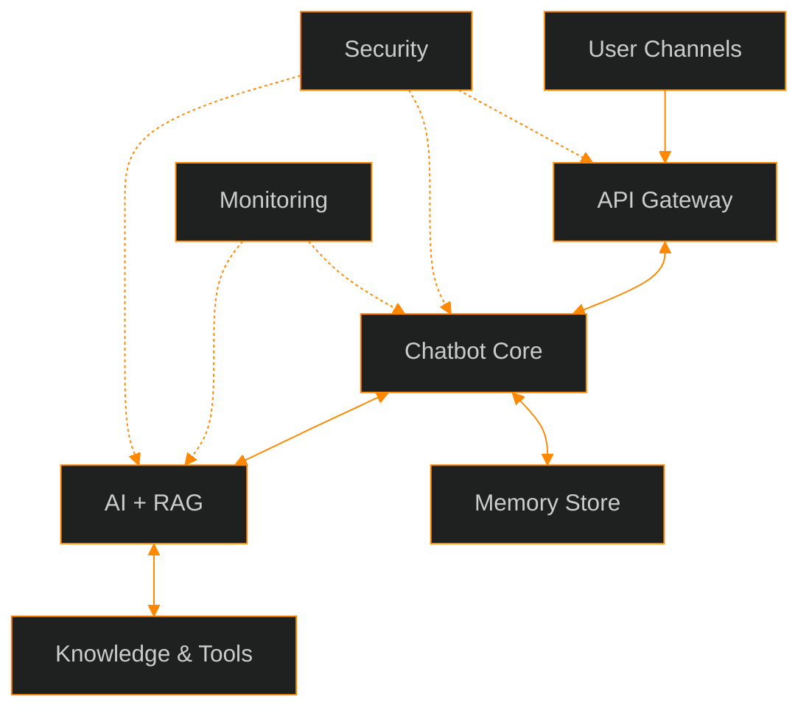

# LLM Lockdown: Outline

## Introduction
- Why you care about AI security ?
- What is OWASP ?
- OWASP Top 10 LLM 2025 Countdown
- Demo
- Summary
- Gift Giveaway

---
#### AI Nightmares
|#| Company Involved                                                                 | Event Description                                                                                                                                   |URL
|-|----------------------------------------------------------------------------------|-----------------------------------------------------------------------------------------------------------------------------------------------------|---
|1| McDonald's                                                                       | "Breach of the McHire AI hiring platform via weak passwords, exposing data of 64 million applicants in July 2025."                                  |https://cybersecuritynews.com/mcdonalds-ai-hiring-bot-leaks/ 
|2| NordVPN                                                                          | "Data breach involving a misconfigured development server with claims of source code theft in early 2026 (reported as ongoing from 2025 activity)." |https://www.forbes.com/sites/daveywinder/2026/01/06/nordvpn-hack---is-your-data-secure-heres-what-really-happened
|3| Anthropic                                                                        | Chinese state-sponsored hackers used Claude AI for autonomous cyber intrusions targeting 30 organizations in 2025.                                  |https://www.anthropic.com/news/disrupting-AI-espionage
|4| Ollama                                                                           | "Over 91000 attack sessions on AI systems via fake servers probing endpoints from October 2025 to January 2026."                                    |https://www.esecurityplanet.com/threats/ai-deployments-targeted-in-91000-attack-sessions
|5| OpenAI                                                                           | Hackers targeted OpenAI systems in widespread attacks on AI endpoints during October 2025 to January 2026.                                          |https://www.esecurityplanet.com/threats/ai-deployments-targeted-in-91000-attack-sessions
|6| Salesforce                                                                       | ShinyHunters abused OAuth tokens in Salesforce environments for data exfiltration in August 2025.                                                   |https://cloud.google.com/blog/topics/threat-intelligence/data-theft-salesforce-instances-via-salesloft-drift
|7| Microsoft                                                                        | Midnight Blizzard exploited a legacy app in Microsoft's environment for privileged access in 2025.                                                  |https://www.mitiga.io/blog/microsoft-breach-by-midnight-blizzard-apt29-what-happened
|8| Google                                                                           | Data breach in Google's Salesforce-linked consumer support operations via phishing in August 2025.                                                  |https://cloud.google.com/blog/topics/threat-intelligence/data-theft-salesforce-instances-via-salesloft-drift
|9| DPRK state actors (North Korea, linked to various Chinese and global companies)  | "North Korean schemes using AI for IT worker infiltration revenue generation and crypto theft in 2025."                                             |https://www.crowell.com/en/insights/client-alerts/doj-announces-major-enforcement-actions-targeting-north-korean-remote-it-worker-schemes
|10| Anthropic                                                                       | "Cyber espionage operation using AI across the attack lifecycle targeting tech firms in November 2025."                                             |https://www.anthropic.com/news/disrupting-AI-espionage

---

### AI Terms
- LLM: Large Language Model
- Agent: autonomous system that can perform tasks, make decisions, and interact with its environment without constant human input. They use artificial intelligence techniques to learn and adapt, allowing them to handle complex tasks across various applications.
- Generative AI: artificial intelligence (AI) that can create original content in response to a user's prompt or request.
- RAG: Retrieval Augmented Generation
- MCP: Model Context Protocol (remote tools)
- Context: scope of information used in generating output
- User Prompt: user information combined with context
- System Prompt: system instructions to apply to user prompt
- Embeddings: representing semantic similar data as numerical vectors in a continuous space
- Vector DB: numerical vectors with chunked context in data store
- Input Sanitize: clean input context by removing dangerous values or phrases
- Output Sanitize: clean output context by removing dangerous values or phrases
- Few-Shot: a low number of message exchanges to achieve objective (zero-shot, one-shot)
- Multi-Shot: multiple message exchanges to achieve objective

---
### Example AI Chat Bot

---

### Example Embedding
 echo "Programming languages like Kotlin and Python are for AI" | ollama run embeddinggemma --dimensions 128 
[-0.17931625,-0.03714802,-0.0059518954,0.072143525,0.06780185,0.07937777,-0.013393623,-0.0284022,0.18445219,-0.15508151,-0.044600125,0.03496174,-0.041209772,-0.09124572,0.094556466,-0.038133953,0.060269885,0.009565133,-0.07554678,-0.034984402,0.00015129845,0.03987074,-0.14811246,-0.063517,0.101511784,0.008480079,0.10765925,0.001762307,-0.06604763,-0.12674738,0.090139546,0.010130008,-0.053024568,0.10109686,0.053040978,0.1366004,0.012840002,-0.029387744,-0.037373148,-0.039525293,0.031445064,0.028607713,0.010642108,-0.034814954,0.0035827998,-0.085612096,-0.20025413,-0.13033275,0.023679536,-0.09624379,0.024011806,0.06418636,-0.080495104,0.017320352,-0.10973218,-0.06924997,-0.1523958,0.013537152,-0.11487369,-0.05025525,-0.14888419,0.06399532,-0.16449584,0.029685194,0.068754934,-0.0026339863,-0.09916971,-0.005607431,0.05826052,0.26312286,-0.099096805,-0.013408992,-0.08622287,-0.09943146,0.34740922,0.15683609,0.0188054,-0.039521553,0.068752624,0.010584586,0.082310624,0.046208814,0.009862862,-0.07879684,0.21890485,-0.023129268,0.014364841,0.05222693,0.028376453,0.032101132,0.16695628,-0.025270468,-0.028132183,0.028614441,-0.029004252,-0.122298755,-0.0072295237,0.036948167,-0.016595384,-0.043169945,-0.08274126,-0.027366236,0.027187934,0.20828398,0.15260269,-0.010650134,-0.023826873,-0.061014075,-0.04006959,0.067638405,-0.049510866,0.041090555,-0.01837514,-0.16425695,-0.043733984,0.0800024,-0.0913453,0.05859742,0.051594935,0.013986562,0.011167494,-0.022490865,0.026260639,-0.09511439,0.04945341,0.03407339,0.020707572,0.048614666]

---
#### TLDR; Prevention and Mitigation Strategies
1.  Input Validation: limit size and expected types
2.  Limit Exposure of Sensative Data: avoid logging private data, use input and output hashs for prompts and results
3.  Rate Limiting and Timeouts: limit calls by source / user over time, timeout to recover resources
4.  Sandbox: isolate and restrict LLM’s access to network resources (model internal threat), tools, services, and APIs.
5.  Observability and Alerting: continuously track cpu, memory, network and disk utilizations, alert on anomalies
6.  Watermarking: apply frameworks to embed and detect unauthorized use of LLM outputs.
7.  Adversarial Robustness Training: train model to detect attacks, improve instructions against glitch tokens
8.  Access Controls: use the authentication token to drive role (RBAC), not the input context, use least privilege
9.  Supply Chain: use internal repositories for runtime, never use outside local network to pull dependencies
10. Automated Deployment: all changes are audited, monitored for unplanned changes, and have an approval workflow (at least 2)

---
## Summary Discussion
### OWASP Top 10 for LLM Applications 2025 (Summary Groups)
- Data and Supply Chain
- Output and System Behavior
- Input and Prompt Risks
---
#### Data and Supply Chain
- **LLM09:2025 Misinformation**
- **LLM08:2025 Vector / Embedding Weaknesses** (new/expanded in 2025)
- **LLM04:2025 Data and Model Poisoning**
- **LLM03:2025 Supply Chain Vulnerabilities**
- **LLM02:2025 Sensitive Information Disclosure**

#####  Threats
- Data Integrity and Poisoning Risks: Adversaries may inject malicious data into training or models, introducing backdoors, biases, or degraded performance, while supply chain compromises embed vulnerabilities or malware in third-party components.
- Privacy and Exposure Vulnerabilities: Sensitive or confidential information can be inadvertently leaked or reconstructed from embeddings, vectors, or model interactions, resulting in breaches, IP theft, or unauthorized data access.

#####  Prevention
- Source Verification and Validation: Use trusted data origins, robust validation pipelines, vendor assessments, and SBOMs to ensure integrity across datasets, models, and dependencies.
- Security Enhancements for Data Handling: Implement encryption, access controls, anomaly detection, and privacy techniques like differential privacy or anonymization to protect embeddings, vectors, and sensitive information.
- Output and Reliability Safeguards: Integrate fact-checking APIs, uncertainty indicators, adversarial testing, and sandboxed environments to mitigate misinformation, biases, and potential leaks.
---
#### Output and System Behavior
- **LLM10:2025 Unbounded Consumption**
- **LLM06:2025 Excessive Agency**
- **LLM05:2025 Improper Output Handling**

#####  Threats
- Resource Exhaustion and Denial of Service: Unbounded consumption allows excessive queries or operations to drain computational resources, leading to high costs, system crashes, or denial-of-service attacks that disrupt availability.
- Autonomous and Unintended Actions: Excessive agency grants LLMs too much independence in executing tasks or accessing tools, resulting in harmful outcomes like data deletion, unauthorized transactions, or escalation of privileges without oversight.
- Output Exploitation Vulnerabilities: Improper output handling fails to sanitize or validate LLM-generated content, enabling risks such as code injections, cross-site scripting (XSS), or propagation of malicious payloads to downstream systems.

#####  Prevention
- Resource Management Controls: Implement rate limiting, quotas, circuit breakers, and monitoring to cap token usage, prevent runaway costs, and detect anomalous consumption patterns early.
- Agency Restriction Measures: Apply least privilege principles, sandbox environments, and human-in-the-loop approvals for high-risk actions to limit the LLM's autonomy and mitigate unintended consequences.
- Output Validation and Sanitization: Use filtering layers, escaping mechanisms, and security checks on all outputs to block injections, ensure safe handling, and integrate with secure parsing in applications.

---
#### Input and Prompt Risks

#####  Threats
#####  Prevention
---
## Detail Discussion
### OWASP Top 10 for LLM Applications 2025 (Ranked #10 to #1)

#### LLM10:2025 Unbounded Consumption**  
Unbounded Consumption occurs when an LLM application permits excessive or uncontrolled inference requests, 
leading to resource exhaustion, denial of service, financial losses, or model cloning attacks.

##### **Threat**  
- Attacker floods API with complex prompts to spike compute costs  
- Malicious user triggers long-running generations to cause DoS for legitimate users  
- Adversary extracts model behavior via repeated queries for distillation/theft  

##### **Example** 
https://sourcegraph.com/blog/security-update-august-2023

##### **Prevention**
- Implement strict per-user rate limiting and token quotas
- Monitor and alert on anomalous consumption patterns in real time
- Use resource caps and auto-scaling with cost thresholds

---
#### **LLM09:2025 Misinformation**  
Over-reliance on LLM outputs without verification can propagate misinformation, 
flawed decisions, or hallucinations with real-world harm.

##### **Threat**  
- LLM generates false medical/legal advice leading to harm  
- Hallucinated facts spread in news or financial summaries  
- Users trust biased or fabricated outputs in critical systems  

##### **Example**
https://stackoverflow.blog/2025/06/30/reliability-for-unreliable-llms (covers real cases of LLM hallucinations causing reliability issues in production tools)

##### **Prevention**  
- Cross-verify outputs with trusted external sources or RAG grounding  
- Add human-in-the-loop review for high-stakes decisions  
- Implement confidence scoring and disclaimer mechanisms  

---
##### **LLM08:2025 Vector / Embedding Weaknesses** (new/expanded in 2025)
Weaknesses in vector databases or embeddings allow poisoning, inversion, or manipulation of RAG-retrieved content.

##### **Threat**
- Poisoned embeddings return malicious documents
- Adversarial vectors cause retrieval of harmful content
- Embedding inversion reconstructs sensitive training data

#### **Example**
https://www.invicti.com/blog/web-security/owasp-top-10-risks-llm-security-2025 (discusses RAG manipulation attacks seen in 2025 RAG deployments)

##### **Prevention**
- Validate and sanitize data before embedding
- Use adversarial training or robustness checks on embeddings
- Apply access controls and versioning to vector stores

---
##### **LLM07:2025 System Prompt Leakage** (new/expanded in 2025)  
Attackers extract or infer hidden system prompts, exposing proprietary instructions or jailbreak defenses.

##### **Threat**  
- Prompt leakage reveals internal guidelines or filters  
- Extracted prompts enable easier jailbreaking  
- Leaked prompts compromise competitive secrets  

##### **Example**
https://www.artificial-intelligence.blog/ai-news/cybersecurity-and-llms (references 2025 incidents of system prompt extraction in commercial LLMs)

##### **Prevention**  
- Obfuscate or encrypt system prompts where possible  
- Use prompt guardrails and output filters to block extraction attempts  
- Regularly rotate and version system instructions  

---
##### **LLM06:2025 Excessive Agency**
Granting LLMs too much autonomy to execute actions without oversight risks unintended or malicious consequences.

##### **Threat**
- LLM agent deletes files or sends unauthorized emails
- Autonomous tool calls escalate privileges unexpectedly
- Agent chains perform harmful multi-step actions
-
##### **Example**
https://www.invicti.com/blog/web-security/owasp-top-10-risks-llm-security-2025 (highlights emerging agentic AI incidents with excessive permissions)

##### **Prevention**
- Enforce least-privilege access for LLM-invoked tools/APIs
- Require user confirmation for sensitive or irreversible actions
- Sandbox agent executions with strict boundaries

---
##### **LLM05:2025 Improper Output Handling**
Failing to sanitize or validate LLM outputs before downstream use enables code execution, XSS, or other exploits.

##### **Threat**
- Malicious output executes as code in backend
- Unsanitized response triggers XSS in web UI
- Output poisons integrated systems or logs

##### **Example**
https://data-security.blog/2024/05/11/safeguarding-ai-systems-against-prompt-injections (includes output handling failures in prompt injection chains)

##### **Prevention**
- Sanitize and validate all LLM-generated content
- Use content security policies for rendered outputs
- Isolate LLM outputs in sandboxed environments
---
##### **LLM04:2025 Data and Model Poisoning**
Malicious tampering with training data or fine-tuning corrupts model behavior or injects backdoors.

##### **Threat**
- Poisoned examples cause biased or harmful outputs
- Backdoor triggers activate on specific inputs
- Data tampering degrades model accuracy

##### **Example**
https://www.machine.news/llms-can-be-hypnotized-into-producing-poisoned-responses-ibm-and-mit-researchers-warn (details real poisoning via feedback/upvotes in 2025 research)

##### **Prevention**
- Validate and audit training/fine-tuning datasets
- Use anomaly detection on input data streams
- Apply robust training methods against poisoning

---
##### **LLM03:2025 Supply Chain Vulnerabilities**
Compromised dependencies, datasets, models, or plugins undermine LLM integrity and introduce backdoors.

##### **Threat**
- Poisoned pre-trained model introduces hidden behaviors
- Vulnerable plugin executes arbitrary code
- Compromised dataset biases or backdoors model

##### **Example**
https://blog.qualys.com/vulnerabilities-threat-research/2024/11/25/ai-under-the-microscope-whats-changed-in-the-owasp-top-10-for-llms-2025 (covers supply chain compromises in LLM ecosystems)

##### **Prevention**
- Vet and verify all third-party models/datasets/plugins
- Use software bill of materials (SBOM) for tracking
- Apply integrity checks and signing on components

---
##### **LLM02:2025 Sensitive Information Disclosure**  
LLMs unintentionally reveal confidential data from training or context, including PII or proprietary info.

##### **Threat**  
- Model regurgitates personal data from training set  
- Context leakage exposes user secrets in responses  
- Inadvertent disclosure of internal docs via RAG  

##### **Example**
https://www.oligo.security/academy/owasp-top-10-llm-updated-2025-examples-and-mitigation-strategies (references data leakage incidents tied to model disclosure)

##### **Prevention**  
- Apply data sanitization and PII redaction filters  
- Use differential privacy techniques in fine-tuning  
- Enforce output scanning for sensitive patterns  

---
##### **LLM01:2025 Prompt Injection**  
Crafted inputs override LLM instructions, leading to unauthorized actions, data leaks, or policy violations.

##### **Threat**  
- Jailbreak bypasses safety filters for harmful content  
- Indirect injection via uploaded files or data  
- Prompt overrides to exfiltrate sensitive data  

##### **Example**
https://nickrogers.blog/locking-down-ai-essential-tips-for-securing-llm-applications (demonstrates real prompt injection attacks bypassing defenses)

##### **Prevention**  
- Enforce privilege separation between user and system prompts  
- Use input/output guard models or filters  
- Apply prompt delimiters and adversarial testing  

---

### Threat Summary
- Excessive resource abuse leading to DoS, cost overruns, or model extraction  
- Propagation of misinformation, hallucinations, or unverified outputs causing harm  
- Over-autonomy in agents/tools resulting in unintended destructive actions  
- Leakage or extraction of proprietary prompts, data, or model internals  
- Poisoning, injection, or supply chain compromises corrupting model integrity  

---

### Prevention Summary
- Implement strict rate limits, quotas, monitoring, and resource caps  
- Enforce input/output validation, sanitization, and guardrail filters  
- Apply least-privilege, sandboxing, and human oversight for actions  
- Use data auditing, integrity checks, and adversarial robustness techniques  
- Ground responses in verified sources and cross-check critical outputs  
- Avoid logging sensitive data, use hashs for input and output data to detect duplicate requests,
	 if you need to keep the data, put has in log and encrypt data and store outside the logs 
- Use containers to host models internally, lock them down, no root, no network outside internal system,
     require authentication and authorization, follow least privilege
-  Smaller memory models have less re-cognition, less recall to training, 
- so they are easier to bypass, they lack adversarial training
---

### Resources
(Repeated from prior response for completeness— these were the primary open-access sources used for the 2025 rankings, details, and incident references.)

- Official OWASP Top 10 for Large Language Model Applications project page: https://owasp.org/www-project-top-10-for-large-language-model-applications  
- OWASP GenAI Security Project LLM Top 10 overview: https://genai.owasp.org/llm-top-10  
- OWASP Top 10 for LLM Applications 2025 resource page: https://genai.owasp.org/resource/owasp-top-10-for-llm-applications-2025  
- Official OWASP Top 10 for LLMs 2025 PDF (direct download, open access): https://owasp.org/www-project-top-10-for-large-language-model-applications/assets/PDF/OWASP-Top-10-for-LLMs-v2025.pdf  
- OWASP LLM10:2025 Unbounded Consumption detailed page: https://genai.owasp.org/llmrisk/llm102025-unbounded-consumption  
- Promptfoo documentation summarizing the 2025 OWASP LLM Top 10 list: https://www.promptfoo.dev/docs/red-team/owasp-llm-top-10  
- Confident AI blog on OWASP Top 10 2025 risks and mitigations: https://www.confident-ai.com/blog/owasp-top-10-2025-for-llm-applications-risks-and-mitigation-techniques  
- Qualys blog on changes in OWASP Top 10 for LLMs 2025: https://blog.qualys.com/vulnerabilities-threat-research/2024/11/25/ai-under-the-microscope-whats-changed-in-the-owasp-top-10-for-llms-2025  
- Barracuda Networks blog on OWASP Top 10 LLM risks 2025 updates: https://blog.barracuda.com/2024/11/20/owasp-top-10-risks-large-language-models-2025-updates  

--------

